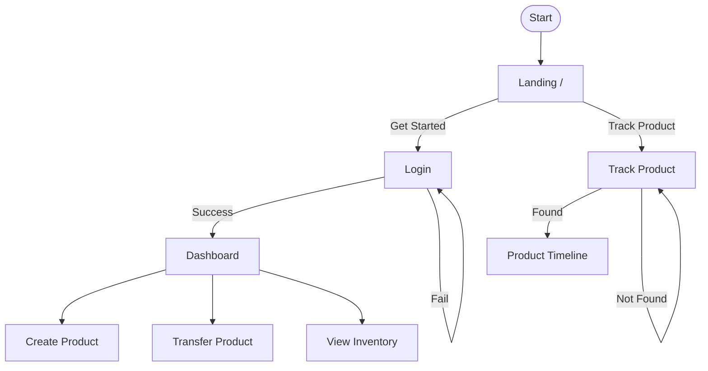
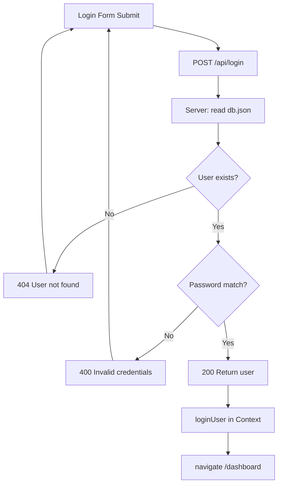
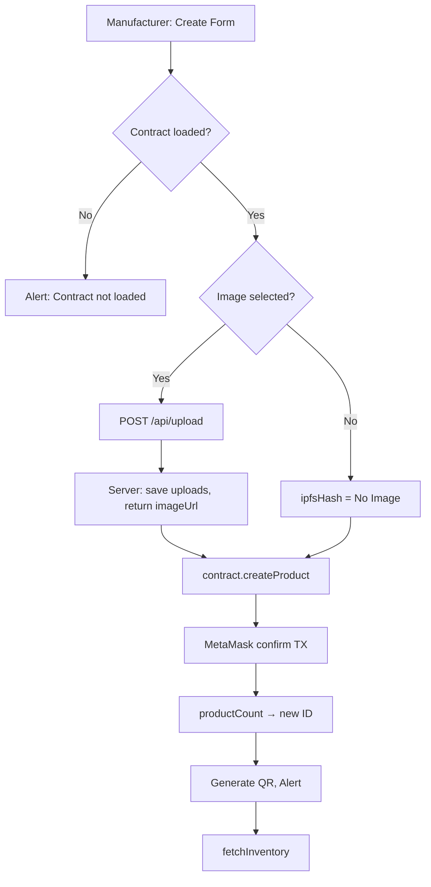
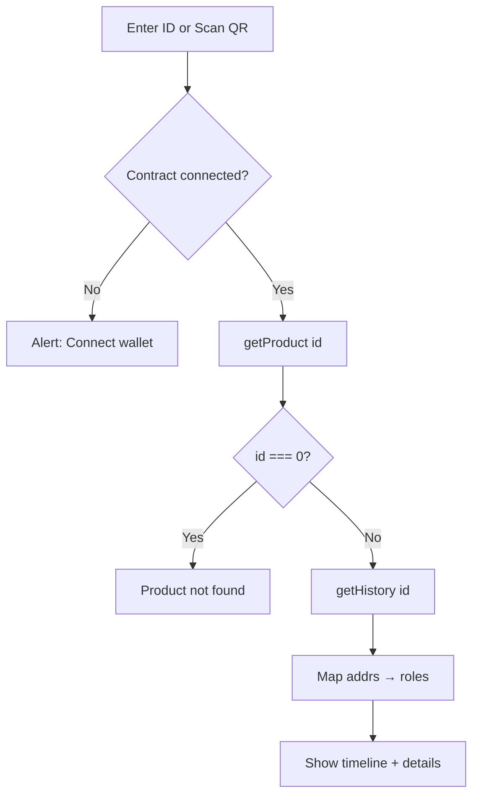
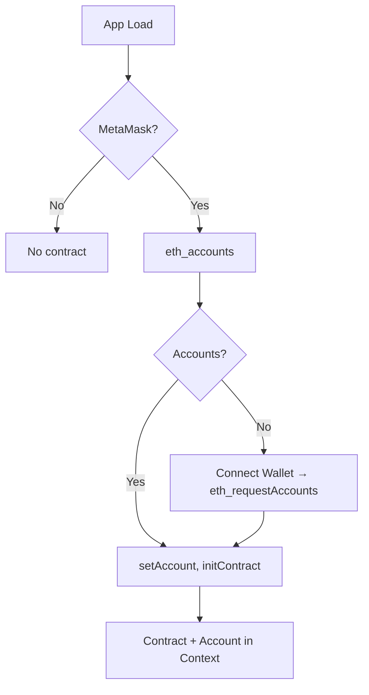
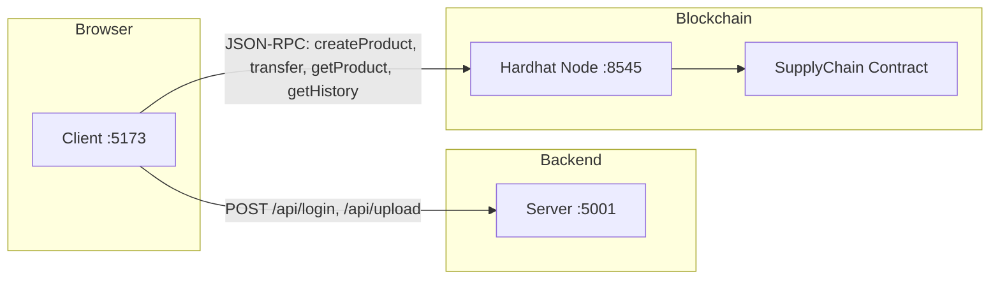
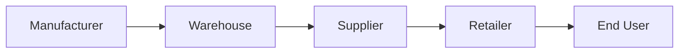

# Flowchart Flows — SupplyChain.io

Use these flows to create flowcharts (Mermaid, draw.io, Lucidchart, etc.). Each section describes **nodes** and **edges** you can map to shapes and arrows.

---

## 1. High-Level User Journey

**Nodes:** Landing → Login | Track Product → Dashboard | Track Product → (Create / Transfer / View)

| Step | Node | Next | Condition / Note |
|------|------|------|------------------|
| 1 | **Start** | Landing (/) | User opens app |
| 2 | **Landing** | Login | Click "Get Started" |
| 2 | **Landing** | Track Product | Click "Track Product" |
| 3 | **Login** | Dashboard | Success → redirect |
| 3 | **Login** | Login (retry) | Invalid credentials |
| 4 | **Dashboard** | Create Product | Manufacturer only |
| 4 | **Dashboard** | Transfer Product | Any role with inventory |
| 4 | **Dashboard** | View Inventory | All logged-in users |
| 5 | **Track Product** | Product Timeline | ID/QR search success |
| 5 | **Track Product** | Error / Retry | Product not found |

**Mermaid:**


---

## 2. Authentication Flow

**Nodes:** Login form → API → DB check → Success / Fail → Context + Redirect

| Step | Node | Next | Condition |
|------|------|------|-----------|
| 1 | **Login Form** | POST /api/login | Submit username, password |
| 2 | **Server** | Read db.json | Load users |
| 3 | **User Lookup** | User exists? | — |
| 4a | Yes | Password match? | — |
| 5a | Match | Return user (role, walletAddress) | 200 |
| 5b | No match | Return "Invalid credentials" | 400 |
| 4b | No | Return "User not found" | 404 |
| 6 | **Client** | loginUser(user) | Store in context + localStorage |
| 7 | **Client** | navigate('/dashboard') | Redirect |

**Mermaid:**


---

## 3. Create Product Flow (Manufacturer)

**Nodes:** Form → Upload Image (optional) → Contract createProduct → QR + Inventory refresh

| Step | Node | Next | Condition |
|------|------|------|-----------|
| 1 | **Dashboard** | User fills name, batchId, image | Manufacturer |
| 2 | **Submit** | Contract loaded? | — |
| 3a | No | Alert "Contract not loaded" | Stop |
| 3b | Yes | Image selected? | — |
| 4a | Yes | POST /api/upload (FormData) | Multipart |
| 5a | **Server** | Save to uploads/, return imageUrl | — |
| 4b | No | ipfsHash = "No Image" | — |
| 6 | **Contract** | createProduct(name, batchId, ipfsHash) | MetaMask tx |
| 7 | **Tx confirmed** | productCount() → new ID | — |
| 8 | **UI** | Generate QR (id, name, batchId), show alert | — |
| 9 | **UI** | fetchInventory() | Refresh list |

**Mermaid:**


---

## 4. Transfer Product Flow

**Nodes:** Select product → Enforce next role → Resolve address → transferProduct → Refresh inventory

| Step | Node | Next | Condition |
|------|------|------|-----------|
| 1 | **My Inventory** | User clicks "Transfer" on item | — |
| 2 | **Transfer form** | productId pre-filled | — |
| 3 | **Submit** | nextRole = flow[currentUser.role] | Manufacturer→Warehouse→Supplier→Retailer→End User |
| 4 | **Next role** | End User? | — |
| 5a | Yes | Require customAddress | User inputs buyer wallet |
| 5b | No | roleWallets[nextRole] | Hardcoded demo addresses |
| 6 | **Contract** | transferProduct(productId, targetAddress, statusInt) | MetaMask tx |
| 7 | **Tx confirmed** | Alert "Transferred to X" | — |
| 8 | **UI** | fetchInventory(), clear form | Item leaves current user |

**Status mapping:** Warehouse=2 (In Warehouse), Supplier/Retailer=1 (In Transit), End User=3 (Delivered).

**Mermaid:**
```mermaid
flowchart TD
    A[Select item → Transfer] --> B[nextRole = flow[role]]
    B --> C{Next = End User?}
    C -->|Yes| D[Input customAddress]
    C -->|No| E[roleWallets nextRole]
    D --> F[transferProduct id, addr, status]
    E --> F
    F --> G[MetaMask confirm]
    G --> H[Alert, fetchInventory]
```

---

## 5. Track Product Flow

**Nodes:** Enter ID or scan QR → getProduct / getHistory → Parse → Show timeline

| Step | Node | Next | Condition |
|------|------|------|-----------|
| 1 | **Track page** | User enters ID or scans QR | — |
| 2 | **Search** | Contract connected? | — |
| 3a | No | Alert "Connect wallet" | Stop |
| 3b | Yes | getProduct(id) | — |
| 4 | **Product** | id === 0? | Not found |
| 5a | Yes | Error "Product not found" | — |
| 5b | No | getHistory(id) | — |
| 6 | **Parse** | Map addresses → roles (Mfg, Warehouse, etc.) | — |
| 7 | **UI** | Show product info + status timeline | Created → … → Delivered |

**Mermaid:**


---

## 6. Wallet & Contract Initialization

**Nodes:** App load → Check MetaMask → eth_accounts / eth_requestAccounts → Init contract → Context

| Step | Node | Next | Condition |
|------|------|------|-----------|
| 1 | **App load** | checkIfWalletIsConnected | useEffect |
| 2 | **MetaMask** | ethereum exists? | — |
| 3a | No | Skip | No contract |
| 3b | Yes | eth_accounts | Existing connection |
| 4 | **Accounts** | length > 0? | — |
| 5a | Yes | setCurrentAccount, initializeContract | — |
| 5b | No | User clicks "Connect Wallet" → eth_requestAccounts | — |
| 6 | **Contract** | BrowserProvider → Signer → Contract(addr, ABI, signer) | — |
| 7 | **Context** | contract, currentAccount available | Dashboard, Track use them |

**Mermaid:**


---

## 7. System Architecture (Components)

**Nodes:** Browser (Client) ↔ Server (API) | Browser ↔ Hardhat (RPC) | Contract on chain.

| Component | Port | Role |
|-----------|------|------|
| **Client** | 5173 | React app; login UI, dashboard, track; calls API + contract |
| **Server** | 5001 | /api/login, /api/register, /api/upload; db.json, uploads/ |
| **Hardhat** | 8545 | Local chain; SupplyChain contract |

**Mermaid:**


---

## 8. Supply Chain Role Flow (Lifecycle)

**Linear flow:** Manufacturer → Warehouse → Supplier → Retailer → End User.

**Mermaid:**


---

## How to Use These Flows

1. **Mermaid:** Paste the code blocks into [Mermaid Live](https://mermaid.live), GitHub README, or any Mermaid-supported editor.
2. **draw.io / Lucidchart:** Create shapes for each **node** and arrows for **Next**; use **Condition** for labels on edges.
3. **PowerPoint / Visio:** Use the tables as a checklist—each row is a box or a decision; "Next" and "Condition" define connections.

---

## Quick Reference — Key Routes & API

| Action | Frontend | API / Blockchain |
|--------|----------|------------------|
| Login | POST /api/login | Server reads db.json |
| Create product | Dashboard form | POST /api/upload → contract.createProduct |
| Transfer | Dashboard transfer form | contract.transferProduct |
| Track | Track page (ID or QR) | contract.getProduct, contract.getHistory |
| Connect wallet | Navbar / Dashboard | eth_requestAccounts → init contract |
